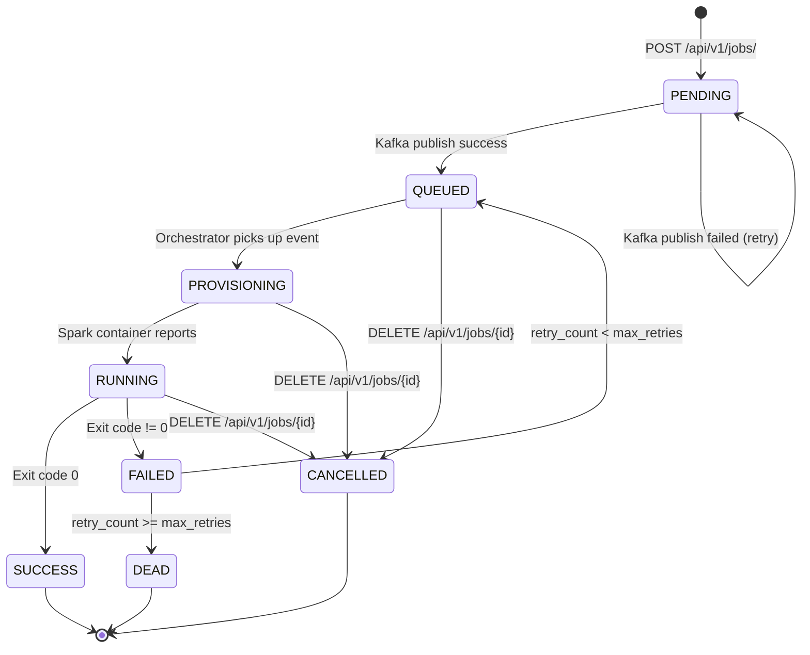
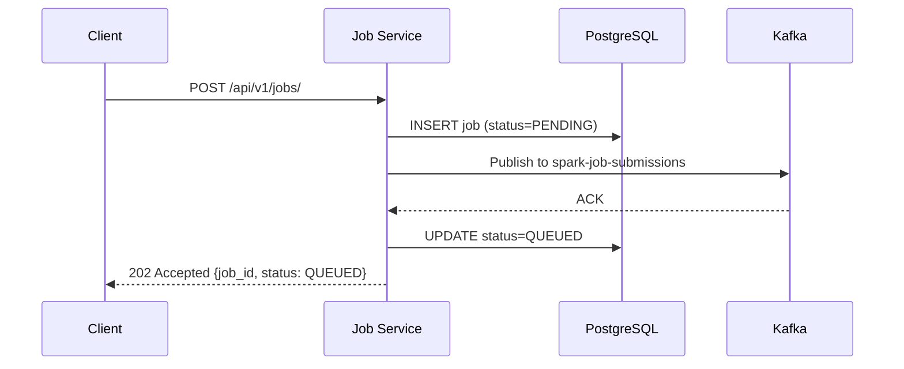
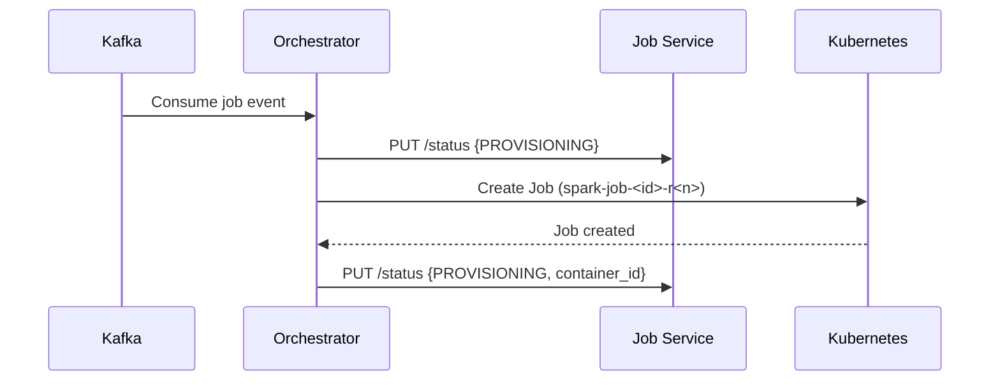
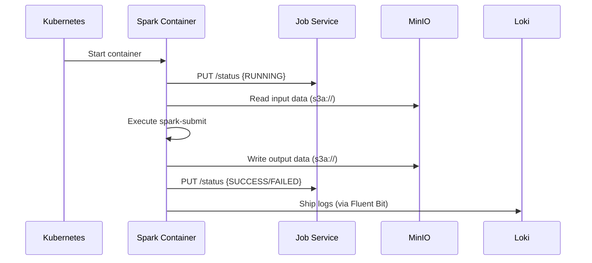
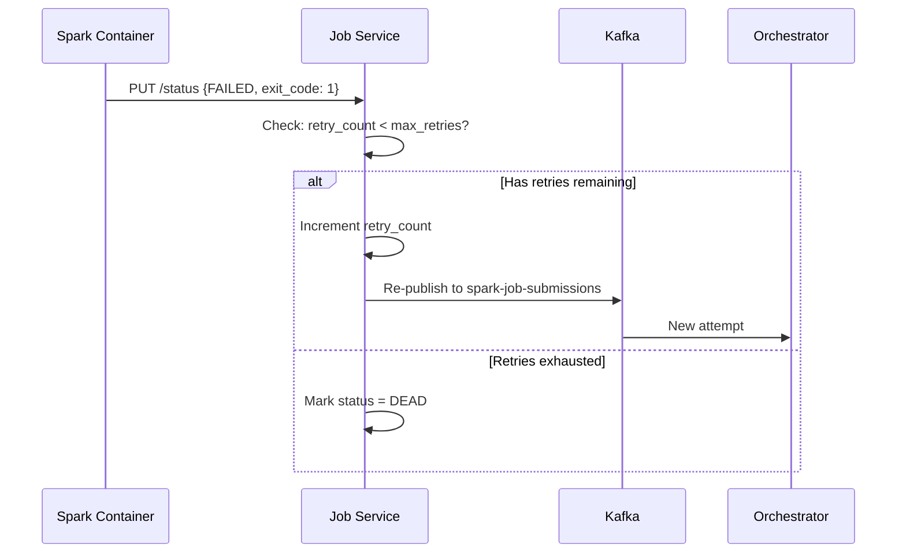

# Data Flow

Understanding how data flows through the DataHarbour platform.

---

## Job Lifecycle



---

## Detailed Event Flow

### 1. Job Submission



### 2. Orchestration



### 3. Spark Execution



### 4. Retry on Failure



---

## Data Storage Layout

```
MinIO Buckets:
├── lakehouse-warehouse/     # Spark job outputs (Iceberg/Parquet)
│   ├── sales_db/
│   │   └── transactions/
│   └── batch10/
│       ├── job1_events/
│       └── ...
├── lakehouse-raw/           # Raw ingestion landing zone
├── lakehouse-scripts/       # Spark job Python scripts
│   ├── etl/
│   │   └── sales_transform.py
│   └── batch10/
│       ├── job_1.py
│       └── ...
└── lakehouse-logs/          # Archived logs
```

---

## Database Schema

### Jobs Tables

```sql
-- Core job tracking
jobs (
    job_id UUID PRIMARY KEY,
    job_name VARCHAR,
    job_type VARCHAR,      -- spark_sql, spark_etl, spark_ml, spark_streaming
    status VARCHAR,        -- PENDING, QUEUED, PROVISIONING, RUNNING, SUCCESS, FAILED, CANCELLED, DEAD
    entrypoint TEXT,
    arguments JSONB,
    spark_config JSONB,
    retry_count INTEGER DEFAULT 0,
    max_retries INTEGER DEFAULT 3,
    ...
)

-- Log references
job_log_refs (job_id, log_source, log_query)
```

### Catalog Tables

```sql
-- Database namespaces
catalog_databases (db_name, owner, description, ...)

-- Table metadata
catalog_tables (db_name, table_name, table_type, location, schema_json, ...)

-- Schema history
schema_history (table_id, version, operation, changes_json, ...)

-- Iceberg snapshots
table_snapshots (table_id, snapshot_id, operation, summary_json, ...)
```
