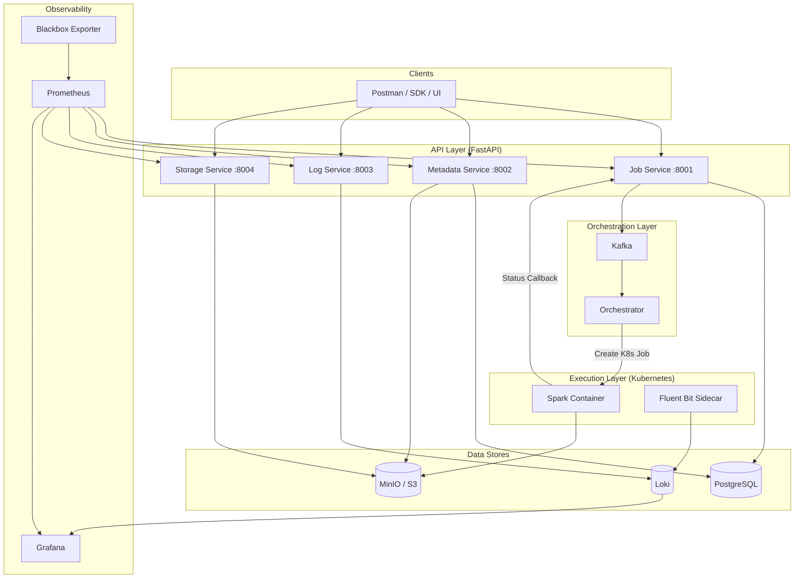

# Architecture Overview

DataHarbour Project follows a **3-layer architecture**: API Layer, Orchestration Layer, and Execution Layer.

---

## Design Goals

1. **API-first** job operations for data teams
2. **Isolated Spark runtime** per job
3. **Durable asynchronous orchestration** via Kafka
4. **Clear metadata governance** for lakehouse objects
5. **Production-style observability** in local development

---

## Logical Architecture

---

## Layer Responsibilities

### API Layer

Four FastAPI microservices handle all external interactions:

- **Job Service** - Job CRUD, status lifecycle, retry logic, Kafka publishing
- **Metadata Service** - Database/table catalog, schema evolution, snapshots
- **Log Service** - Log retrieval/streaming from Loki via LogQL
- **Storage Service** - S3 bucket/object management, presigned URLs

### Orchestration Layer

- **Kafka** provides durable, ordered event delivery
- **Orchestrator** consumes job events and translates them into Kubernetes Jobs

### Execution Layer

- Each Spark job runs in an **isolated Kubernetes pod**
- Jobs execute in `local[*]` mode (no cluster manager needed)
- **Callback-driven status** - containers report their own lifecycle
- Optional **Fluent Bit sidecar** ships logs to Loki

---

## Key Design Decisions

| Decision | Rationale |
|----------|-----------|
| Event-driven orchestration | Decouples submission from execution; durable delivery |
| Callback-driven status | No polling; Spark containers report their own state |
| App-level retries | `backoff_limit=0` on K8s; Job Service manages retry logic |
| Namespace isolation | Platform in `lakehouse-platform`, Spark in `lakehouse-jobs` |
| S3-compatible storage | MinIO locally, production S3 ready with zero code changes |
| Iceberg-first catalog | Future-proof table format with time-travel and schema evolution |

---

## Security Model

| Layer | Mechanism |
|-------|-----------|
| External API | `X-API-Key` header with constant-time comparison |
| Internal callbacks | `X-Internal-Token` header |
| Health endpoints | Unauthenticated (by design) |
| Network (K8s) | NetworkPolicy restricts Spark pod egress |

---

## Known Constraints

- Local mode requires a running Kubernetes cluster for Spark execution
- Kafka topics use auto-create in local dev
- Job status is callback-driven (container must report status)
- No distributed tracing yet (planned: OpenTelemetry)
