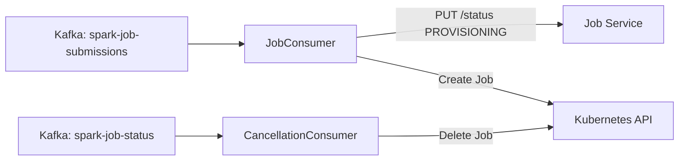

# Services

Detailed breakdown of each microservice in the DataHarbour platform.

---

## Service Summary

| Service | Framework | Port | Persistence | Key Dependencies |
|---------|-----------|------|-------------|------------------|
| Job Service | FastAPI + asyncpg + aiokafka | 8001 | PostgreSQL | Kafka, Log Service |
| Metadata Service | FastAPI + asyncpg | 8002 | PostgreSQL | MinIO |
| Log Service | FastAPI + httpx | 8003 | Loki | -- |
| Storage Service | FastAPI + boto3 | 8004 | MinIO | -- |
| Orchestrator | asyncio + aiokafka + kubernetes | -- | Kafka + K8s | Job Service |

---

## Common Patterns

All API services share these patterns:

- **Python 3.11** on `python:3.11-slim` Docker images
- **Uvicorn** with 4 workers
- **Health endpoints**: `/health` (liveness) and `/health/ready` (readiness)
- **Prometheus metrics**: `/metrics` via `prometheus_fastapi_instrumentator`
- **CORS middleware** with configurable origins
- **Pydantic v2** for request/response validation
- **Structured JSON logging**
- **Graceful shutdown** with lifespan context managers

---

## Job Service (Port 8001)

The central service for job lifecycle management.

### Responsibilities

- Accept job submissions and persist to PostgreSQL
- Publish submission events to Kafka
- Track job status transitions
- Handle retry logic on failures
- Proxy log retrieval from Log Service
- Accept internal status callbacks from Spark containers

### Endpoints

| Method | Path | Description |
|--------|------|-------------|
| GET | `/health` | Health check |
| GET | `/health/ready` | Readiness check |
| POST | `/api/v1/jobs/` | Submit a new job |
| GET | `/api/v1/jobs/` | List jobs (paginated, filterable) |
| GET | `/api/v1/jobs/{job_id}` | Get job details |
| DELETE | `/api/v1/jobs/{job_id}` | Cancel a job |
| PUT | `/api/v1/jobs/{job_id}/status` | Update status (internal) |
| GET | `/api/v1/jobs/{job_id}/logs` | Get job logs |

### Dependencies

- PostgreSQL (job persistence)
- Kafka (event publishing)
- Redis (caching)
- Log Service (log retrieval)

---

## Metadata Service (Port 8002)

Manages the lakehouse catalog: databases, tables, schema evolution, and snapshots.

### Responsibilities

- CRUD operations on databases (namespaces)
- CRUD operations on tables with schema validation
- Schema evolution (add, drop, rename columns)
- Iceberg snapshot tracking

### Endpoints

| Method | Path | Description |
|--------|------|-------------|
| GET | `/health` | Health check |
| POST | `/api/v1/databases/` | Create database |
| GET | `/api/v1/databases/` | List databases |
| GET | `/api/v1/databases/{db_name}` | Get database |
| DELETE | `/api/v1/databases/{db_name}` | Delete database |
| POST | `/api/v1/databases/{db_name}/tables/` | Create table |
| GET | `/api/v1/databases/{db_name}/tables/` | List tables |
| GET | `/api/v1/databases/{db_name}/tables/{table_name}` | Get table |
| PUT | `/api/v1/databases/{db_name}/tables/{table_name}` | Update table schema |
| DELETE | `/api/v1/databases/{db_name}/tables/{table_name}` | Delete table |
| GET | `/api/v1/databases/{db_name}/tables/{table_name}/snapshots` | List snapshots |

### Dependencies

- PostgreSQL (catalog persistence)
- MinIO/S3 (table location resolution)

---

## Log Service (Port 8003)

Provides log retrieval and real-time streaming.

### Responsibilities

- Query Loki for job-specific logs via LogQL
- Support source filtering (stdout, stderr, driver, executor)
- Provide SSE streaming endpoint for real-time log tailing

### Endpoints

| Method | Path | Description |
|--------|------|-------------|
| GET | `/health` | Health check |
| GET | `/api/v1/logs/{job_id}` | Get job logs |
| GET | `/api/v1/logs/{job_id}/stream` | Stream logs (SSE) |

### Dependencies

- Loki (log storage backend)

---

## Storage Service (Port 8004)

Abstracts S3/MinIO operations for bucket and object management.

### Responsibilities

- Create and list buckets
- List objects with prefix filtering and pagination
- Generate presigned URLs for upload/download
- Delete objects

### Endpoints

| Method | Path | Description |
|--------|------|-------------|
| GET | `/health` | Health check |
| POST | `/api/v1/storage/buckets` | Create bucket |
| GET | `/api/v1/storage/buckets` | List buckets |
| GET | `/api/v1/storage/buckets/{bucket}/objects` | List objects |
| POST | `/api/v1/storage/buckets/{bucket}/presigned-url` | Get presigned URL |
| DELETE | `/api/v1/storage/buckets/{bucket}/objects/{key}` | Delete object |

### Dependencies

- MinIO/S3 (object storage)

---

## Orchestrator

Event-driven bridge between Kafka and Kubernetes.

### Responsibilities

- Consume job submission events from Kafka
- Create Kubernetes Jobs for Spark execution
- Handle job cancellation events
- Manage namespace and service account creation
- Inject runtime configuration into Spark containers

### Architecture

### Dependencies

- Kafka (event consumption)
- Kubernetes API (job management)
- Job Service (status callbacks)
