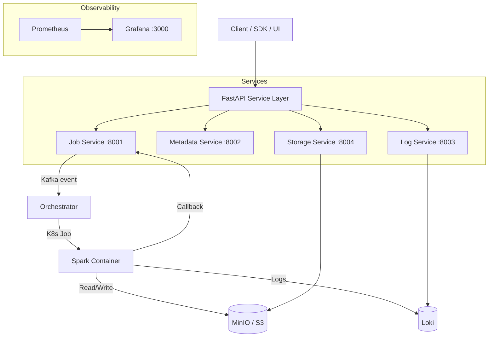

# DataHarbour Project (DHP)

An **API-first, on-premise data lakehouse platform** for running Spark jobs with strong operational controls.

---

## What is DHP?

DataHarbour Project (DHP) provides a complete platform for:

- **Job submission, cancellation, status tracking, and retries** via REST APIs
- **Metadata catalog** for databases and tables with schema evolution
- **Object storage management** for S3/MinIO
- **Centralized logs and metrics** with Grafana dashboards
- **Kubernetes-backed isolated Spark runtime** per job

This repository is optimized for local development while preserving production-like patterns: event-driven orchestration, health probes, observability, and service separation.

---

## Architecture at a Glance

---

## Core Components

| Component | Port | Purpose |
|-----------|------|---------|
| Job Service | 8001 | Submit/list/get/cancel jobs and read logs |
| Metadata Service | 8002 | Manage databases, tables, schema, snapshots |
| Log Service | 8003 | Retrieve/stream job logs from Loki |
| Storage Service | 8004 | Manage buckets, objects, presigned URLs |
| Orchestrator | -- | Consumes Kafka events and creates K8s Spark Jobs |
| Grafana | 3000 | Dashboards and platform observability |
| Prometheus | 9090 | Metrics scraping and probing |
| Loki | 3100 | Log storage and query backend |
| MinIO | 9000/9001 | S3-compatible object storage |
| Kafka | 9092 | Job queue and async event backbone |
| PostgreSQL | 5432 | Job and catalog metadata persistence |
| Redis | 6379 | Service cache |

---

## Quick Links

- [Getting Started](getting-started/quickstart.md) - Run the platform in under 5 minutes
- [Architecture](architecture/overview.md) - Understand how components interact
- [Writing Spark Jobs](spark/writing-jobs.md) - Submit your first Spark job
- [API Reference](api-reference.md) - Full endpoint documentation
- [Troubleshooting](operations/troubleshooting.md) - Common issues and fixes
