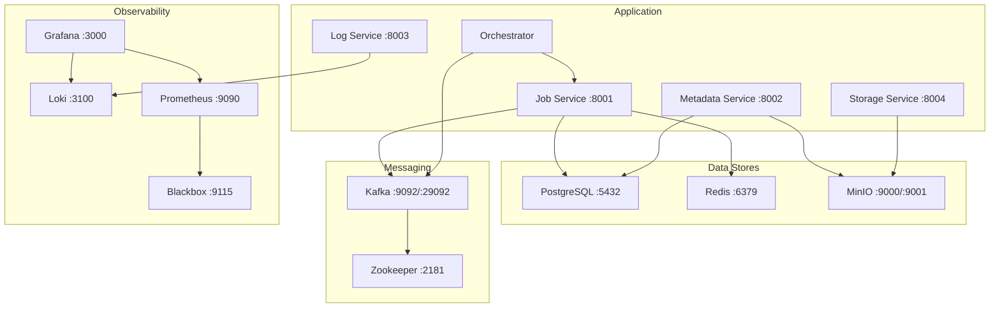

# Docker Compose

Local development stack configuration.

---

## Overview

The Docker Compose stack runs 13 services on a single bridge network (`lakehouse-network`):



---

## Commands

```bash
# Start all services
make up

# Stop all services
make down

# View logs
make logs

# Rebuild images
make build

# Full cleanup (removes volumes)
make clean
```

---

## Service Dependencies

Services start in dependency order:

1. **Data stores**: PostgreSQL, Redis, MinIO (start first, with healthchecks)
2. **Messaging**: Zookeeper → Kafka (with healthcheck)
3. **Observability**: Loki → Blackbox → Prometheus → Grafana
4. **Application**: Services wait for their dependencies to be healthy

---

## Port Mappings

| External Port | Internal Port | Service |
|:---:|:---:|---|
| 5432 | 5432 | PostgreSQL |
| 6379 | 6379 | Redis |
| 2181 | 2181 | Zookeeper |
| 9092 | 9092 | Kafka (internal) |
| 29092 | 29092 | Kafka (host access) |
| 9000 | 9000 | MinIO API |
| 9001 | 9001 | MinIO Console |
| 3100 | 3100 | Loki |
| 9090 | 9090 | Prometheus |
| 9115 | 9115 | Blackbox Exporter |
| 3000 | 3000 | Grafana |
| 8001 | 8000 | Job Service |
| 8002 | 8000 | Metadata Service |
| 8003 | 8000 | Log Service |
| 8004 | 8000 | Storage Service |

---

## Volumes

| Volume | Purpose |
|--------|---------|
| `pgdata` | PostgreSQL data |
| `miniodata` | MinIO objects |
| `lokidata` | Loki chunks |
| `grafanadata` | Grafana state |
| `prometheusdata` | Prometheus TSDB |

!!! warning
    `make clean` removes all volumes. Use `make down` to preserve data.

---

## Init Containers

- **minio-init**: Creates default buckets (`lakehouse-warehouse`, `lakehouse-raw`, `lakehouse-scripts`, `lakehouse-logs`)

---

## Host-to-Container Access

The orchestrator uses `extra_hosts` to reach the host machine from Docker:

```yaml
extra_hosts:
  - "host.docker.internal:host-gateway"
```

This allows Spark containers (running in K8s) to reach Docker Compose services via `host.docker.internal`.
