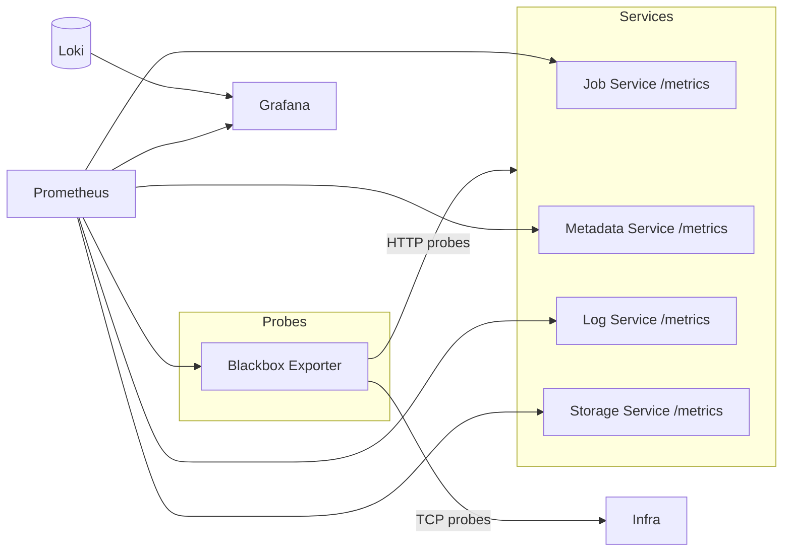

# Monitoring

Prometheus, Grafana, and Loki observability stack.

---

## Architecture



---

## Prometheus

**Endpoint**: http://localhost:9090

### Scrape Targets

| Job Name | Target | Interval |
|----------|--------|----------|
| `job-service` | `:8001/metrics` | 15s |
| `metadata-service` | `:8002/metrics` | 15s |
| `log-service` | `:8003/metrics` | 15s |
| `storage-service` | `:8004/metrics` | 15s |
| `loki` | `:3100/metrics` | 15s |
| `prometheus` | `:9090/metrics` | 15s |
| `blackbox-http` | Multiple HTTP endpoints | 30s |
| `blackbox-tcp` | Multiple TCP ports | 30s |

### Blackbox HTTP Probes

Checks that these respond with 2xx:

- All service health endpoints
- MinIO health, Loki ready, Prometheus health, Grafana health

### Blackbox TCP Probes

Verifies connectivity to:

- All services (ports 8001-8004)
- Kafka (9092), Zookeeper (2181)
- PostgreSQL (5432), Redis (6379)
- MinIO (9000), Loki (3100), Prometheus (9090)

### Useful Queries

```promql
# Service availability
up{job=~"job-service|metadata-service|log-service|storage-service"}

# Request rate by service
sum by (job) (rate(http_requests_total[5m]))

# P95 latency
histogram_quantile(0.95, sum by (job, le) (rate(http_request_duration_seconds_bucket[5m])))

# Error rate
sum by (job) (rate(http_requests_total{status=~"5.."}[5m]))
```

---

## Grafana

**Endpoint**: http://localhost:3000  
**Login**: admin / admin

### Auto-Provisioned Dashboard

**Name**: Lakehouse Platform Admin Operations Overview  
**UID**: `lakehouse-admin-ops`  
**URL**: http://localhost:3000/d/lakehouse-admin-ops

### Dashboard Panels (13 total)

| Panel | Description |
|-------|-------------|
| HTTP Probe Status | Blackbox HTTP check results |
| TCP Probe Status | Blackbox TCP check results |
| Service Scrape Status | `up` metric for all services |
| API Throughput | Requests/second by service |
| API Error Rate | 5xx errors by service |
| API P95 Latency | 95th percentile response time |
| CPU Usage | Per-service CPU consumption |
| Memory Usage | Per-service memory consumption |
| Open File Descriptors | Per-service FD count |
| Job API Activity | Job submission/completion rates |
| Log Volume | Logs ingested per time unit |
| Recent Errors | Error log entries from Loki |
| Service Health Summary | Combined health overview |

### Datasources

| Name | Type | UID |
|------|------|-----|
| Prometheus | prometheus | `prometheus` (default) |
| Loki | loki | `loki` |

---

## Loki

**Endpoint**: http://localhost:3100

### Log Labels

| Label | Source |
|-------|--------|
| `job_id` | Spark job identifier |
| `source` | Log source (stdout, stderr) |
| `container_id` | Container ID |

### Query Examples

```logql
# All logs for a job
{job_id="abcd1234-5678-9012-3456-789012345678"}

# Only errors
{job_id="...", source="stderr"}

# Search for pattern
{job_id="..."} |= "Exception"
```

---

## Metrics Exposed by Services

All API services use `prometheus_fastapi_instrumentator` which exposes:

- `http_requests_total` - Request count by method, path, status
- `http_request_duration_seconds` - Request latency histogram
- `http_requests_in_progress` - Active requests gauge
- Process metrics (CPU, memory, FDs, threads)
