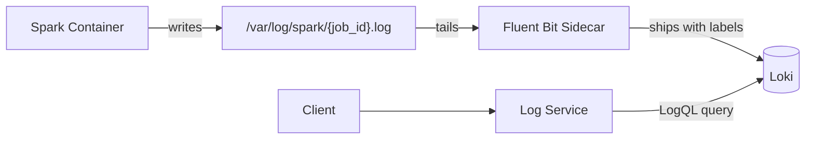

# Log Service

Provides centralized log retrieval and real-time streaming for Spark jobs.

---

## Overview

- **Port**: 8003
- **Framework**: FastAPI + httpx (async Loki client)
- **Container**: `lakehouse-log-service`

---

## API Endpoints

### Get Logs

```bash
GET /api/v1/logs/{job_id}?source=all&tail=500
```

**Parameters:**

| Param | Default | Description |
|-------|---------|-------------|
| `source` | `all` | Filter by source: `stdout`, `stderr`, `driver`, `executor`, `all` |
| `tail` | 500 | Number of log lines (1-10000) |

**Response:**

```json
{
  "job_id": "uuid-here",
  "source": "all",
  "log_count": 42,
  "entries": [
    {
      "timestamp": "2026-03-28T10:00:00Z",
      "source": "stdout",
      "message": "[INFO] Starting Spark submit..."
    }
  ]
}
```

### Stream Logs (SSE)

```bash
GET /api/v1/logs/{job_id}/stream?source=all
```

Returns Server-Sent Events for real-time log tailing:

```
event: log
data: [2026-03-28T10:00:00Z] [stdout] Starting Spark submit...

event: log
data: [2026-03-28T10:00:01Z] [stdout] Processing records...
```

---

## How Logs Get to Loki



Labels applied to logs:

- `job_id` - Unique job identifier
- `source` - Log source (stdout, stderr)
- `container_id` - Container ID

---

## LogQL Queries

The Log Service translates job_id into LogQL:

```logql
{job_id="<job_id>"}                    # All sources
{job_id="<job_id>", source="stderr"}   # Errors only
```

---

## Environment Variables

| Variable | Required | Description |
|----------|----------|-------------|
| `LOKI_URL` | Yes | Loki endpoint (e.g., `http://loki:3100`) |
| `API_KEY` | Yes | API key for authentication |
