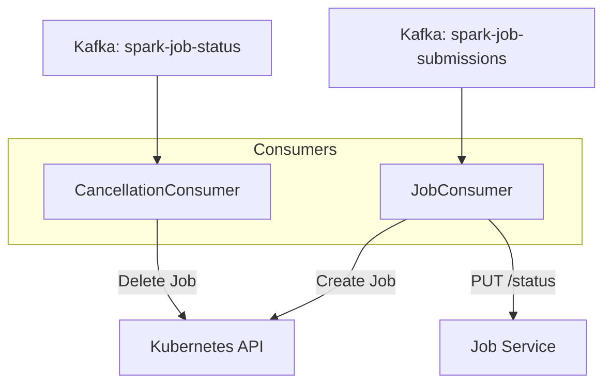

# Orchestrator

Event-driven bridge between Kafka and Kubernetes that manages Spark job execution.

---

## Overview

- **Framework**: Python asyncio + aiokafka + kubernetes-client + httpx
- **Container**: `lakehouse-orchestrator`
- **No external port** (event-driven, no REST API)

---

## Architecture



---

## How It Works

### Job Submission Flow

1. Consumes message from `spark-job-submissions` topic
2. Calls Job Service to mark job as `PROVISIONING`
3. Creates a Kubernetes Job named `spark-job-<jobid8>-r<retry_count>`
4. Injects environment variables into the Spark container
5. On failure: marks job as `FAILED` with error message

### Job Cancellation Flow

1. Consumes message from `spark-job-status` topic
2. Looks for `action: "cancel"` events
3. Deletes the Kubernetes Job by job_id label

---

## Kubernetes Job Spec

Each Spark job creates:

```yaml
apiVersion: batch/v1
kind: Job
metadata:
  name: spark-job-<first8chars>-r<retry>
  namespace: lakehouse-jobs
  labels:
    app: lakehouse-spark
    job-id: <full-job-id>
spec:
  backoffLimit: 0        # App-level retries only
  ttlSecondsAfterFinished: 3600
  template:
    spec:
      serviceAccountName: spark-runner
      containers:
        - name: spark-<first8chars>
          image: lakehouse-spark:3.5.0
          env:
            - JOB_ID
            - ENTRYPOINT_SCRIPT
            - ARGUMENTS
            - CALLBACK_URL
            - INTERNAL_API_TOKEN
            - AWS_ACCESS_KEY_ID
            - AWS_SECRET_ACCESS_KEY
            - S3_ENDPOINT
            - KAFKA_BROKERS
            - SPARK_EXTRA_CONF
          resources:
            requests: {cpu: 250m, memory: 512Mi}
            limits: {cpu: 1000m, memory: 2Gi}
        - name: fluent-bit  # optional sidecar
      restartPolicy: Never
```

---

## Runtime URL Resolution

The orchestrator manages URL resolution between Docker network and Kubernetes:

| Purpose | Docker Network | Spark Container (K8s) |
|---------|---------------|----------------------|
| Job Service | `http://job-service:8000` | `http://host.docker.internal:8001` |
| MinIO | `http://minio:9000` | `http://host.docker.internal:9000` |
| Kafka | `kafka:9092` | `host.docker.internal:29092` |

The `RUNTIME_*` env vars configure what Spark containers see.

---

## Kubernetes Host Access

When running in Docker Compose, the orchestrator needs to reach the local K8s API:

- Mounts `~/.kube/config` as read-only
- Rewrites `localhost` → `host.docker.internal` in kube config
- Optionally skips TLS verification for local dev

---

## Environment Variables

| Variable | Required | Description |
|----------|----------|-------------|
| `KAFKA_BROKERS` | Yes | Kafka bootstrap servers |
| `JOB_SERVICE_URL` | Yes | Job Service URL (Docker network) |
| `RUNTIME_JOB_SERVICE_URL` | Yes | Job Service URL for Spark containers |
| `RUNTIME_S3_ENDPOINT` | Yes | MinIO URL for Spark containers |
| `RUNTIME_KAFKA_BROKERS` | Yes | Kafka URL for Spark containers |
| `INTERNAL_API_TOKEN` | Yes | Token for Job Service callbacks |
| `S3_ACCESS_KEY` | Yes | S3 access key |
| `S3_SECRET_KEY` | Yes | S3 secret key |
| `K8S_IN_CLUSTER` | No | `true` when running inside K8s |
| `SPARK_IMAGE` | No | Spark Docker image tag |
| `K8S_NAMESPACE` | No | Namespace for Spark jobs |
| `ENABLE_FLUENT_BIT_SIDECAR` | No | Enable log shipping sidecar |
